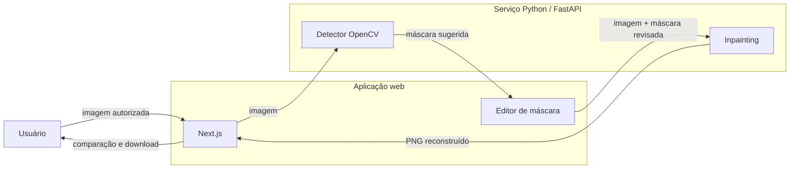

# RemoveIT

> Remoção assistida de marcas d'água em imagens, com detecção automática, máscara editável e processamento local.

O **RemoveIT** analisa uma imagem, sugere as regiões que parecem fazer parte da marca d'água e permite corrigir essa seleção antes da reconstrução final. Todo o fluxo pode ser executado na sua própria máquina: as imagens não precisam ser enviadas para serviços externos e os arquivos temporários expiram automaticamente.

> [!IMPORTANT]
> Use o RemoveIT somente em imagens próprias ou para as quais você tenha autorização de edição. A interface exige essa confirmação antes de aceitar um arquivo.

## O que já funciona

- Upload de JPG, PNG e WebP com até **20 MB** e **40 milhões de pixels**.
- Detecção automática da provável região da marca d'água.
- Editor de máscara com pincel de até 1 px, borracha, zoom, movimentação e desfazer.
- Reconstrução por LaMa quando o pacote de IA está instalado, com fallback OpenCV.
- Redetecção da máscara sem precisar reenviar a imagem.
- Comparação interativa entre original e resultado.
- Download do resultado em PNG.
- Histórico da sessão atual.
- Sessões assinadas, limites de requisição e autenticação entre os serviços.
- Exclusão automática dos trabalhos temporários após o prazo configurado.
- Interface responsiva e fluxo utilizável por teclado.

## Como o projeto funciona



O sistema é dividido em dois processos:

| Componente | Tecnologia | Responsabilidade |
| --- | --- | --- |
| Aplicação web | Next.js 16, React 19 e TypeScript | Interface, sessões, API, arquivos temporários e coordenação dos jobs |
| Processamento | Python 3.12, FastAPI e OpenCV | Detecção da máscara e reconstrução da imagem |

Não existe banco de dados nesta versão. Os jobs e as imagens ficam em `.removeit-tmp` e são removidos depois de `JOB_TTL_MINUTES`.

## Requisitos

- [Node.js](https://nodejs.org/) 20 ou superior.
- [Python](https://www.python.org/) 3.12 ou 3.13. O modo LaMa ainda não é compatível com Python 3.14 por causa da cadeia NumPy do pacote.
- Git.
- Windows PowerShell, Terminal ou shell equivalente.

## Rodando no Windows

Você utilizará dois terminais: um para o serviço de imagens e outro para a aplicação web.

### 1. Clone e configure

```powershell
git clone https://github.com/oluisvi/RemoveIT.git
cd RemoveIT
Copy-Item .env.example .env.local
```

Para uso exclusivamente local, o `.env.example` já contém valores funcionais. Se quiser personalizar, edite `.env.local` e mantenha o mesmo `INFERENCE_SERVICE_TOKEN` nos dois processos.

### 2. Inicie o processador de imagens

No primeiro terminal:

```powershell
cd inference
py -3.12 -m venv .venv
.\.venv\Scripts\Activate.ps1
pip install -e .

$env:INFERENCE_SERVICE_TOKEN="replace-with-a-long-random-token"
python -m uvicorn app.main:app --reload --port 8000
```

O comando acima instala o modo leve. Para habilitar a reconstrução com o modelo LaMa local (download maior e primeira execução mais lenta), use:

```powershell
pip install -e ".[ml]"
$env:INPAINT_ENGINE="auto"
```

Em `auto`, o serviço usa LaMa quando disponível e recua para OpenCV se o modelo opcional não estiver instalado. Para exigir a IA sem fallback, use `INPAINT_ENGINE=lama`; para o modo leve, `INPAINT_ENGINE=opencv`.

Se o PowerShell bloquear a ativação do ambiente virtual:

```powershell
Set-ExecutionPolicy -Scope Process Bypass
.\.venv\Scripts\Activate.ps1
```

Confira o serviço em [http://127.0.0.1:8000/health](http://127.0.0.1:8000/health). A resposta esperada é:

```json
{"status":"ok"}
```

### 3. Inicie a aplicação

No segundo terminal, a partir da raiz do projeto:

```powershell
npm ci
npm run dev
```

Abra [http://localhost:3000](http://localhost:3000). Se a porta estiver ocupada, o Next.js mostrará no terminal o novo endereço.

## Próximas execuções

As dependências só precisam ser instaladas uma vez.

Terminal do processador:

```powershell
cd "<caminho-do-projeto>\RemoveIT\inference"
.\.venv\Scripts\Activate.ps1
$env:INFERENCE_SERVICE_TOKEN="replace-with-a-long-random-token"
python -m uvicorn app.main:app --reload --port 8000
```

Terminal da aplicação:

```powershell
cd "<caminho-do-projeto>\RemoveIT"
npm run dev
```

Use `Ctrl+C` nos dois terminais para encerrar.

## Variáveis de ambiente

| Variável | Padrão local | Uso |
| --- | --- | --- |
| `REMOVEIT_TMP_DIR` | `.removeit-tmp` | Diretório dos jobs e imagens temporárias |
| `INFERENCE_SERVICE_URL` | `http://127.0.0.1:8000` | Endereço do serviço Python |
| `INFERENCE_SERVICE_TOKEN` | `local-development` no código | Token Bearer compartilhado entre Next.js e FastAPI |
| `INFERENCE_TIMEOUT_MS` | `90000` | Tempo máximo de uma operação de processamento |
| `INPAINT_ENGINE` | `auto` | Seleciona `auto`, `lama` ou `opencv` no serviço Python |
| `JOB_TTL_MINUTES` | `30` | Vida útil de cada job |
| `SESSION_SECRET` | valor local interno | Assinatura do cookie de sessão |
| `CLEANUP_SECRET` | valor local interno | Proteção da rota interna de limpeza |

Em produção, nunca reutilize os segredos do exemplo.

## Comandos disponíveis

```powershell
npm run dev        # servidor de desenvolvimento
npm run build      # build otimizado de produção
npm run start      # executa o build de produção
npm run lint       # análise estática
npm run typecheck  # validação do TypeScript
npm test           # testes unitários e de integração
npm run test:e2e   # testes completos no navegador
```

Testes do serviço Python:

```powershell
cd inference
.\.venv\Scripts\Activate.ps1
pip install -e ".[test]"
python -m pytest tests -q
```

## API interna

| Método | Rota | Função |
| --- | --- | --- |
| `POST` | `/api/jobs` | Valida a autorização, recebe a imagem e cria o job |
| `GET` | `/api/jobs/:jobId` | Consulta o estado do job |
| `PUT` | `/api/jobs/:jobId/mask` | Salva a máscara revisada |
| `POST` | `/api/jobs/:jobId/redetect` | Executa novamente a detecção sobre a imagem original |
| `POST` | `/api/jobs/:jobId/process` | Inicia a reconstrução |
| `GET` | `/api/jobs/:jobId/result` | Entrega original, máscara ou resultado autorizado |
| `DELETE` | `/api/jobs/:jobId` | Cancela e remove o job |

O serviço Python expõe `/v1/detect` e `/v1/inpaint`. Essas rotas exigem `Authorization: Bearer <INFERENCE_SERVICE_TOKEN>` e não foram projetadas para exposição pública direta.

## Estrutura do repositório

```text
RemoveIT/
├── app/                 # páginas e rotas HTTP do Next.js
├── components/          # upload, editor, resultado e componentes visuais
├── inference/           # serviço FastAPI de visão computacional
├── lib/                 # domínio, segurança, persistência e integrações
├── tests/               # testes Vitest
├── e2e/                 # testes Playwright
└── instrumentation.ts   # limpeza periódica dos jobs expirados
```

## Segurança e privacidade

- Os arquivos permanecem na máquina em que o projeto está rodando.
- Cookies de sessão são assinados e `HttpOnly`.
- Cada job pertence à sessão que o criou.
- A API valida formato, tamanho real e quantidade de pixels da imagem.
- Há limites separados para criação e processamento de jobs.
- O serviço Python rejeita chamadas sem o token compartilhado.
- Caminhos de arquivos são resolvidos dentro do diretório temporário permitido.
- Trabalhos expirados são removidos automaticamente.

## Limitações atuais

A versão atual usa visão computacional clássica e filtros conservadores para sugerir a máscara. Na reconstrução, pode usar LaMa localmente ou OpenCV Navier–Stokes como fallback leve. Isso mantém o projeto executável em CPU, mas ainda impõe alguns limites:

- marcas translúcidas, muito grandes ou misturadas a texturas complexas podem exigir ajuste manual;
- o fallback OpenCV pode ficar perceptível em rostos, textos, padrões repetitivos ou áreas com muitos detalhes;
- o modo LaMa consome mais memória e pode baixar os pesos do modelo na primeira utilização;
- o armazenamento em disco e os limites em memória foram pensados para uma única instância local;
- o histórico existe apenas durante a sessão e enquanto os arquivos temporários não expirarem.

O editor de máscara faz parte do fluxo justamente para corrigir detecções imperfeitas antes do processamento.

## Caminho de evolução

- Adaptador opcional para modelos avançados de segmentação e inpainting.
- Prévia em tempo real da máscara e do resultado.
- Processamento em lote.
- Armazenamento externo e fila de jobs para múltiplas instâncias.
- Empacotamento desktop para iniciar tudo com um clique.

---

Feito para devolver ao usuário o controle sobre a própria imagem — com revisão humana antes de qualquer alteração definitiva.
